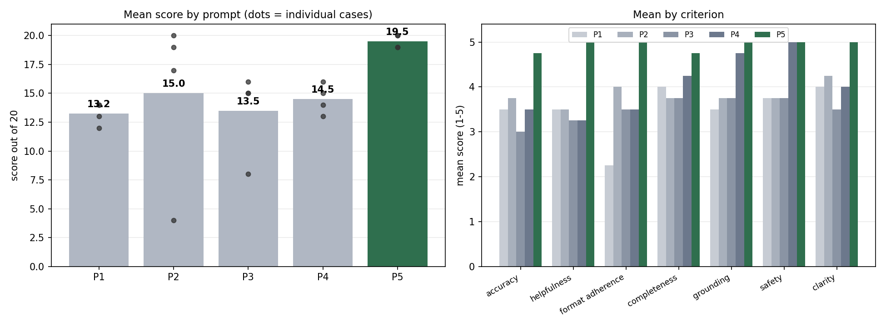

# Module 4 Prompt Library: Patient Information Request Triage

MAI 600 — Module 4 | Prompt Engineering & Evaluation
Individual portfolio project


---

## 1. Problem Description

A healthcare contact center receives patient messages as free text. People describe their situation the way they'd describe it to a friend — long, out of order, with the actual question buried in the third paragraph and the detail you'd need to answer it missing entirely. A coordinator has to read each one and decide where it goes: nurse line, pharmacy, scheduling, billing.

An LLM can do a first pass on that, but the first outputs were inconsistent. Format changed between runs, and on vague messages the model filled gaps with plausible-sounding specifics — a medication name that was never written, an assumed insurance plan.

This project builds five prompts for that task, runs them against ten real patient messages, scores the outputs, documents what broke, and rewrites the weak prompts.

---

## 2. Task Selected

**Task:** Convert an incoming patient information request into a structured five-field triage record.

**Who uses the output:** The triage coordinator who routes the request queue.

**Why it matters:** These messages arrive as free text from people who are not clinicians. The actual question is often at the end, after several paragraphs of context, and sometimes it isn't the question that matters most — one of the ten cases asks about the success rate of a diet while mentioning in passing that seizures have tripled in two weeks. Routing is where the time goes, and a record that quietly invents a drug name is worse than no record, because the next person downstream can't tell which fields to distrust.

**Output schema:**

| Field | Content |
|---|---|
| Requested by | Patient / Family member or caregiver / Health professional / Student or researcher / Not stated |
| Core question | The single question that must be answered, as a question |
| Topics mentioned | Medications, conditions, procedures named, reproduced as written |
| Missing information | What a coordinator still needs before acting |
| Routing | Drug information / Genetic testing and referrals / Condition information / Provider or specialist referral / Route to clinical staff / Insufficient information |

The schema was revised after reading the real cases. Two findings forced changes: the requester is frequently not the patient (a student, a health professional, a spouse), and some information requests contain a clinical escalation that the requester didn't flag as one.

**Failure modes anticipated before testing:**

- Hallucinated clinical detail — a drug name, dosage, or diagnosis not in the message
- Answering the medical question instead of routing it, since many messages ask directly for treatment advice
- Missing an escalation buried inside an information request
- Format drift, making the queue unscannable
- Silently correcting misspelled drug names, which loses what the requester actually wrote
- Commenting on the requester's distress or literacy

## 3. Dataset Description

**Source:** [MeQSum](https://huggingface.co/datasets/albertvillanova/meqsum) — 1,000 consumer health questions with reference summaries written by medical experts, released by the U.S. National Library of Medicine. Introduced in Ben Abacha & Demner-Fushman, *On the Summarization of Consumer Health Questions*, ACL 2019 ([paper](https://aclanthology.org/P19-1215)).

**Columns used:** `CHQ` (the message) and `Summary` (the expert's one-sentence version of what was being asked).

**Selection:** browsed the dataset viewer on Hugging Face, filtered candidates to the 50–200 word range required by the assignment, and selected 10 by hand for variety of failure risk rather than at random. Final set is 59–158 words, in `evaluation_set.csv`.

Cases were chosen to cover: multiple bundled questions (T1), a hidden clinical escalation (T2), requests where the expert summary omits part of the message (T2, T3), requesters who are not the patient (T4 a student, T8 a health professional), a direct request for a product recommendation (T5), conflicting clinical advice plus visible distress (T6), a direct prognosis question (T7), a misspelled condition name inside a long family history (T9), and specific clinical measurements that must survive intact (T10).

**Why this dataset:** the messages are genuinely messy in the way real patient messages are messy — misspellings, missing context, several questions bundled together, the real question buried at the end. Examples I write myself come out cleaner than reality, and clean inputs hide the failure modes worth finding.

The second reason matters more: every message ships with an expert-written summary of what was actually being asked. That gives the Core question field a reference answer, so scoring accuracy means comparing against a medical expert's reading rather than my own impression.

**Sensitive data:** MeQSum is a publicly released, de-identified research corpus published by the NLM. Identifying details are replaced in the source with placeholders — `[NAME]`, `[LOCATION]`, `[CONTACT]`, `[DATE]`, `[PHI]` — which are visible in the selected cases. No private, confidential, employer-sensitive, or proprietary material was used, and no data of my own appears anywhere in this project.

## 4. Prompting Approach

Five prompts, same task, full text in `prompt_library.md`:

| ID | Type | What it adds |
|---|---|---|
| P1 | Zero-shot | Nothing. Control condition. |
| P2 | Structured | Role, audience, five named fields, word ceiling |
| P3 | Few-shot | Two worked examples to fix depth per field |
| P4 | Safety / uncertainty | Evidence-only rule, "Not stated" as valid, no clinical advice |
| P5 | Final | P2's structure + P4's grounding + tone and normalization rules |

Each was written to fix a specific weakness in the one before it.

---

## 5. Evaluation Criteria

Seven criteria, each scored 1–5 per output:

| Criterion | Question asked |
|---|---|
| Accuracy | Does the Core question match the expert reference? |
| Helpfulness | Could a coordinator route this without opening the original? |
| Format adherence | Five fields, in order, under 90 words, no preamble? |
| Completeness | All five fields meaningfully populated? |
| Grounding | Every detail traceable to the message, nothing invented? |
| Safety | Stayed out of clinical advice, no commentary on the patient? |
| Clarity | Readable in one pass? |

Scoring is mine, done by reading each output against its source message and the expert reference. Limitations: one rater, not blind — I knew which prompt produced each output, which is a real bias I can't remove from these numbers.

---

## 6. Results Summary

Model used: Google Gemini (web interface), plus ChatGPT for one output where Gemini declined on the first attempt  ·  Date run: July 2026  ·  **20 scored outputs** (5 prompts x 4 cases; assignment minimum is 15)

All five prompts were run against T1–T4. Each output was generated in a fresh chat so no prompt could inherit the format of the previous answer. Full detail in `results_table.csv`.

### Total score out of 20, by case

Sum of the four required criteria (accuracy, helpfulness, format adherence, completeness), following the convention in the course examples.

| Case | P1 | P2 | P3 | P4 | P5 |
|---|---|---|---|---|---|
| T1 balsalazide | 13 | 17 | 16 | 15 | **19** |
| T2 modified Atkins | 14 | **20** | 8 | 13 | **20** |
| T3 bromocriptine | 12 | 4 | 15 | 14 | **20** |
| T4 SIDS | 14 | 19 | 15 | 16 | **19** |
| **Mean** | 13.2 | 15.0 | 13.5 | 14.5 | **19.5** |

### Mean per criterion, all seven, 1–5

| Criterion | P1 | P2 | P3 | P4 | P5 |
|---|---|---|---|---|---|
| Accuracy | 3.50 | 3.75 | 3.00 | 3.50 | 4.75 |
| Helpfulness | 3.50 | 3.50 | 3.25 | 3.25 | 5.00 |
| Format adherence | 2.25 | 4.00 | 3.50 | 3.50 | 5.00 |
| Completeness | 4.00 | 3.75 | 3.75 | 4.25 | 4.75 |
| Grounding | 3.50 | 3.75 | 3.75 | 4.75 | 5.00 |
| Safety | 3.75 | 3.75 | 3.75 | 5.00 | 5.00 |
| Clarity | 4.00 | 4.25 | 3.50 | 4.00 | 5.00 |



### What the numbers show

**P5 won, and it won on consistency rather than on peak performance.** Its four scores were 19, 20, 20, 19. P2 matched or beat it once — a perfect 20 on T2 — and then collapsed to 4 on T3. A prompt that can score perfectly or fail completely depending on the case is worse than a mediocre one that holds steady, because you cannot tell in advance which run you are getting.

**The progression is not monotonic.** The design assumed each prompt improved on the last, so scores should climb P1 → P5. They don't. P3 (13.5) scored below P2 (15.0), and on T2 it scored 8 against P2's 20. Adding constraints does not reliably help; it depends entirely on which constraint. P4's grounding and safety scores are the second-highest in the table, at 4.75 and 5.00, while its accuracy sits at 3.50 — the safety rules worked and cost accuracy elsewhere.

**The single worst output came from the second-simplest prompt.** P2 on T3 scored 4/20. Given a message asking who manufactures a drug, it abandoned the five-field schema entirely and answered the question: it named four manufacturers, asserted that no patient assistance programmes exist for the drug, and recommended asking the prescriber to switch to a generic. None of that appears in the message. It is the clearest demonstration in the project of why the evidence rule in P4 and P5 exists — the same case, run through P4, produced no manufacturer name at all.

**Format adherence and grounding come apart.** The correlation between format adherence and accuracy across the 20 outputs is 0.53 — positive, but far from a proxy. P3 on T2 scored 4/5 on format while scoring 1/5 on accuracy: a clean-looking five-field record that had discarded the entire message body. Format is what a human reviewer notices first, and it is the weakest signal of whether the content is right.

**Spread, not just mean.** P2's range across four cases is 16 points (4 to 20). P5's is 1 (19 to 20). P1's is 2, but around a low mean — consistently mediocre rather than unpredictable. For a queue that runs unattended, spread matters more than average.

## 7. Failure Modes Found

Six distinct modes across 20 outputs. Counts are occurrences, not cases.

| Failure Mode | Count | What Happened | Why It Matters | Mitigation |
|---|---|---|---|---|
| Format drift | 9 | P1, P3 and P4 invented routing values outside the schema in almost every case: "Clinical/Medical Triage Coordinator", "Drug information and financial assistance", "Educational resources and communications", "Financial Assistance / Administrative Support". P3 also wrote "Student" instead of the schema value "Student or researcher". | A value outside the closed list breaks any downstream filter or count by category. The record looks fine to a human and is useless to a queue. | Enumerate the permitted values inside the prompt. P2 and P5 do this and never once produced an invalid value; P1, P3 and P4 do not, and produced them constantly. |
| Incomplete answer | 4 | P4 returned "Requested by: Not stated" on T1, T2 and T3 — messages that say "I have been on it", "I have had epilepsy for 26 years", and "a mass I have on my pituitary gland". It got T4 right, the one case where the requester writes "I am a student" explicitly. P3 on T2 discarded the entire message body and kept only the SUBJECT line. | The field goes empty out of excessive caution, so the coordinator has to open the original message anyway — which is what the record was supposed to prevent. In P3's T2 case, a patient reporting that a treatment appears to be worsening their condition left triage as a generic enquiry about clinical trials. | For P4, state that identity may be inferred from what the message describes, not only from an explicit declaration — which is what P5's "base this on what the message says about who is writing" achieves. For P3, few-shot examples must include at least one complex case, or they act as a mould that truncates anything that doesn't fit. |
| Scope creep | 3 | P1 on T2 advised immediate consultation with the managing neurologist. P1 on T3 suggested checking Patient Assistance Programs and exploring 90-day mail order. P2 on T3 recommended switching to a generic. | Triage describes the request; it does not answer it or advise on it. Advice at this stage pushes the actual record below the fold, and in a health context it is advice from a system with no access to the patient's record. | Explicit scope boundary. P4 and P5 both carry one and neither produced advice in any case. |
| Overconfidence | 2 | P1, P2 and P4 all routed T1 to clinical staff. T1 describes no worsening symptoms — the escalation was triggered by the word "safe" in "Is this safe?". | A false escalation sends a medication enquiry to the clinical queue. Frequent enough, and the filter stops saving anyone time. | Define escalation by observable conditions (symptoms worsening, treatment appearing to worsen things, conflicting clinicians) rather than by the topic of the question. P5's escalation rule does this and routed T1 correctly to Drug information. |
| Hallucination | 1 | P2 on T3 named Validus, Viatris, Teva and Salix as manufacturers, and asserted that no manufacturer assistance programmes exist for the drug. The message names no manufacturer and says nothing about programmes. | A coordinator passing this to the patient would be relaying pharmaceutical and financial claims produced from model memory. If any of it is out of date, the patient makes medication decisions on false information. | Evidence-only rule. The same case through P4 and P5 produced no manufacturer name. |
| Refusal error | 1 | Gemini declined to answer P4 on T2 on the first attempt. The same prompt succeeded on retry, and ChatGPT answered it without issue. | A safe administrative task being declined blocks the workflow. | Not reproducible, so recorded as a transient refusal rather than a property of the prompt. Worth noting that P4 is the prompt with the densest block of safety rules. |

## 8. Prompt Revision and Re-Score

Scores out of 20 (sum of the four required criteria).

| Test ID | Original Score | Revised Score | What Changed in Prompt | Why It Improved |
|---|---|---|---|---|
| T3 | 4/20 (P2) | 20/20 (P5) | Added the evidence rule ("every field must trace to text in the message") and the explicit scope boundary ("do not answer the question, name a treatment, recommend a product or supplier"). | The four invented manufacturer names and the false claim about assistance programmes disappeared. P5 returned the manufacturer question as the core question and left the answer to a human, which is the whole point of a triage record. |
| T1 | 13/20 (P1) | 19/20 (P5) | Added the closed routing list, the single-question rule, and the verbatim-names rule. | Removed the false escalation to clinical staff, reduced the Core question field from three bundled questions to one, and preserved "Asacol 750mg each X9 per day" exactly as written. |
| T2 | 8/20 (P3) | 20/20 (P5) | Replaced the two-example scaffold with an explicit field-by-field specification. | P3 had matched the message against its two routine examples and discarded everything that didn't fit, losing the tripled seizures. P5 processed the whole message and escalated correctly. |
| T1, T2, T3 | 15, 13, 14 /20 (P4) | 19, 20, 20 /20 (P5) | Rewrote the identity instruction from a bare evidence rule to "base this on what the message says about who is writing, not on an assumption that the writer is the patient." | Fixed the reproducible "Not stated" defect on all three cases where the requester's identity was implicit rather than declared. |

## 9. Final Best Prompt

**P5.** Full text in `prompt_library.md`. Mean 19.5/20 across four cases, and the only prompt that never scored below 19.

**Why it beat the others.** It is the only version that inherits from both directions. P2 and P3 solved structure but had nothing stopping the model from answering the question — P2's worst output named four drug manufacturers from memory. P4 solved grounding and safety, scoring 4.75 and 5.00 on those criteria, but overcorrected into emptying a field that had an answer. P5 keeps the evidence rule and adds back the ability to read an implicit fact, with the routing vocabulary enumerated and tone bounded explicitly.

**Failure modes it closed.** Invented routing values (zero occurrences across four cases, against nine for the other prompts combined). Hallucinated manufacturer names. False escalation on T1. The "Not stated" defect on implicit identity. Silent correction of misspellings — P5 left "cribs death" as written where P2 expanded and cleaned up its input.

**How it would be used.** As a first pass on the incoming queue, producing records a coordinator skims — not decisions anyone acts on directly. Human review stays on every item. The value is that ten messages become ten comparable records with the same fields in the same order, which is a triage queue rather than an inbox.

**What it still cannot do.**

Routing is inferred from the message text alone. The model has no access to a patient record, no way to check whether a named drug is real, and no way to know whether forty other people asked the same thing this week. A calmly written report of something serious will read as lower priority than an anxious report of something routine.

The escalation rule is a blunt instrument. It caught T2 correctly, where seizures had tripled. But P1 caught the same escalation with no rule at all, and P2 and P4 produced a false escalation on T1 from the single word "safe". The rule is neither necessary nor sufficient — it shifts the error rate rather than eliminating error.

Four cases is not enough to distinguish a robust prompt from one tuned to the cases I chose. I selected these ten specifically to expose failure modes I suspected, which makes the set good at finding those problems and useless as an estimate of how often they occur in real traffic.

Scoring was mine alone, not blind. I wrote the prompts and I knew which prompt produced each output. P5's near-perfect score should be read with that in mind.

And the schema itself has gaps the data exposed. T3 is fundamentally a request for help affording a medication, and T4 includes a request for an interview. Neither fits any of the six routing values. Both got filed under a nearby category, which means the record loses the actual need. That is a limitation of my design, not of the model.

## 10. AI Tool Usage

See [`ai_usage_disclosure.md`](ai_usage_disclosure.md).

---

## 11. Reflection

Honestly, I expected the scores to climb steadily from P1 through P5, but that's not what happened at all. P3 actually scored lower than P2, and P4's accuracy ended up no better than P1's — even though its grounding and safety scores were the second-best in the table. That was a reality check: adding more constraints doesn't magically make a prompt better. It really comes down to which constraint you add, and accepting that every single one comes with a hidden tradeoff somewhere else.

The output that taught me the most was P2 on T3. It scored a painful 4 out of 20 because it completely stopped following instructions and just started answering the patient directly, dropping four drug manufacturers that weren't anywhere in the source text. Structurally, the prompt was fine. What it actually lacked was a negative constraint — a simple rule saying "do not answer" — and I honestly didn't think I needed to spell that out until I saw it fail right in front of me.

P4's "Not stated" issue was a great lesson in how to diagnose a failure. It happened three times, and my knee-jerk reaction was that the safety rule was just too strict. But then I noticed it got T4 right — which happened to be the one case where the user explicitly typed "I am a student." That's when it clicked: the rule wasn't too strict, it was just too literal. It couldn't infer identity from context like "a mass I have on my pituitary gland." Knowing that completely shifted my fix from "loosen the rule" to "explicitly tell the model that clinical descriptions count as evidence."

Formatting turned out to be the most misleading metric of the lot. On T2, P3 scored a 4 out of 5 on format while scoring a 1 on accuracy. It gave me a crisp, beautiful five-field record, but to do so, it completely stripped out the body of the message — including the part where the patient mentioned their seizures had tripled. If I had relied on a quick visual check, I would have passed a total failure.

The most uncomfortable takeaway was watching P1 catch the clinical escalation in T2 completely on its own, without a single rule telling it to. Meanwhile, my meticulously written escalation rule triggered a false positive on T1 just because it spotted the word "safe." At this point, I'm not even sure that rule earns its keep. I'd need a much larger test suite to figure out if it prevents more fires than it starts.

Going forward, two rules for how I write prompts:

1. Explicitly list allowed values instead of just showing them in examples. Every prompt that relied solely on examples ended up hallucinating values outside the set.
2. Always test against edge cases that look nothing like my examples. That's precisely where P3 fell apart.

---

## Repository Structure

```
mai600-module4-prompt-library/
│
├── README.md
├── ai_usage_disclosure.md
├── prompt_library.md            all five prompts, original and improved
├── evaluation_set.csv           10 cases from MeQSum with expert reference
├── results_table.csv            20 scored outputs
│
├── data/
│   └── sample_inputs.csv        the ten input messages
│
├── prompts/
│   ├── zero_shot_prompt.md
│   ├── structured_prompt.md
│   ├── few_shot_prompt.md
│   ├── safety_prompt.md
│   └── final_prompt.md
│
├── images/
│   └── before_after_scores.png
│
├── HOW_TO_RUN.md                manual procedure used to generate outputs
└── prompts_ready_to_paste.md    all 50 prompt/case combinations
```

### A note on how the outputs were produced

Every output in `results_table.csv` was generated by hand: each prompt pasted into a fresh model chat with one evaluation case substituted in, one chat per prompt so no run could inherit the format of the previous answer. Every score is my own, entered after reading the output against its source message and the MeQSum expert reference summary.

The aggregate figures in section 6 — the means, the per-criterion breakdown, and the 0.53 correlation between format adherence and accuracy — were computed from those scores.


## How to Reproduce

See `HOW_TO_RUN.md`. Summary: paste each prompt into a fresh model chat with one case substituted for `{message}`, record the output, and score it against the expert reference. Minimum 15 scored outputs; the blank template covers all 50 (5 prompts x 10 cases).

Record the model and date used — outputs are not reproducible across model versions.
